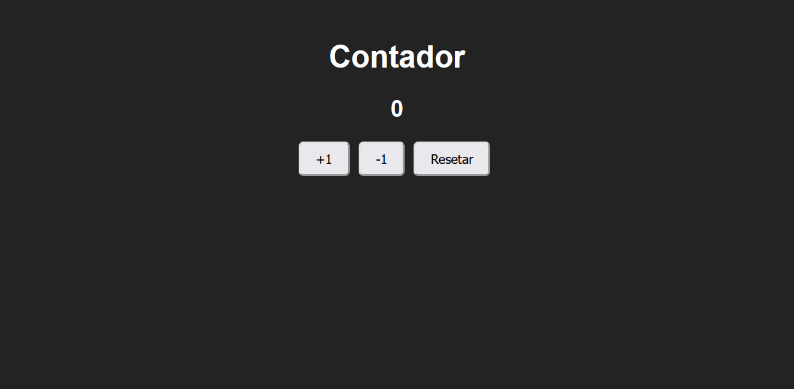

## Projeto Contador

</img>  
Projeto criado com HTML, CSS, e JavaScript para simular um contador com três botôes. São eles de incremento, decremento e um para resetar.

## Build

<a href="https://gustavormendes.github.io/contador/" target="_blank">Projeto Contador</a>
